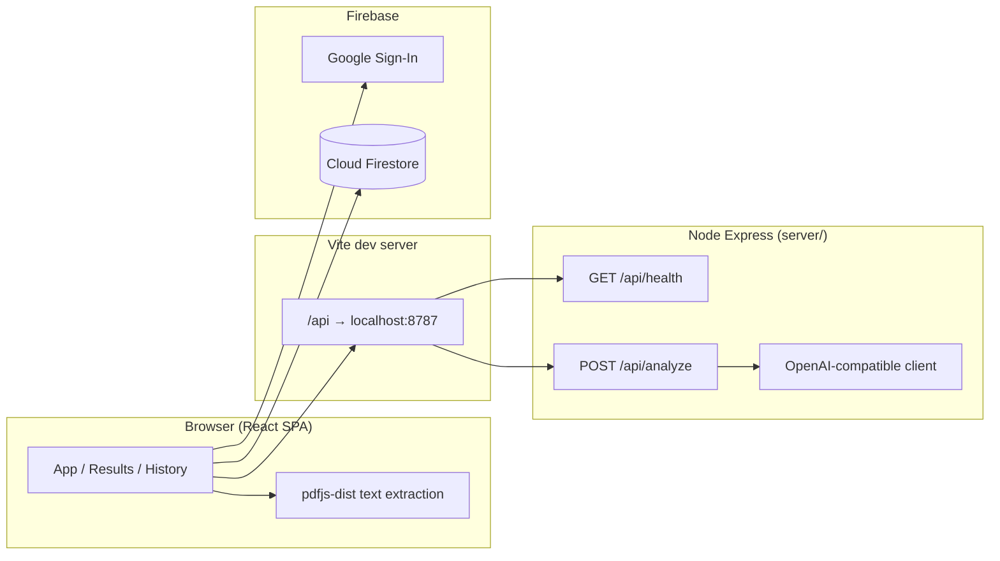

# Architecture

This document describes how **Unfold** is structured technically: processes, data stores, APIs, and security boundaries.

---

## High-level diagram

In **production**, the static frontend is typically served separately; the browser must reach the same-origin or configured API base for `/api` routes (or you add a reverse proxy).

---

## Frontend (`client/`)

| Piece              | Technology           | Purpose                                                                           |
| ------------------ | -------------------- | --------------------------------------------------------------------------------- |
| UI                 | React 18, TypeScript | Pages: Homescreen (upload + results), History, About; navigation and auth chrome. |
| Build              | Vite 6               | Dev server, HMR, production bundle.                                               |
| PDF text           | `pdfjs-dist`         | Client-side PDF parsing; `.txt` read as plain text.                               |
| Auth & persistence | Firebase JS SDK      | Google popup sign-in; Firestore for saved runs when configured.                   |

### API calls during development

[Vite is configured](client/vite.config.ts) to proxy `/api` to `http://127.0.0.1:8787`. The React app uses relative URLs such as `fetch("/api/analyze", …)`, so no CORS issues arise between the SPA and the API on localhost.

### Analysis payload shape

The backend returns JSON matching the [OpenAI chat completions](https://platform.openai.com/docs/api-reference/chat) flow, but the **application schema** is defined in TypeScript as `[Analysis](client/src/types.ts)`: `plain_summary`, `sections[]`, `risks[]`, `open_questions[]`, plus optional legacy `key_points`. The client runs `[normalizeAnalysis](client/src/analysisNormalize.ts)` to tolerate older or partial model output.

---

## Backend (`server/`)

| Piece | Technology           | Purpose                                                           |
| ----- | -------------------- | ----------------------------------------------------------------- |
| HTTP  | Express 4            | JSON body parser (large limit for document text), CORS enabled.   |
| LLM   | `openai` npm package | Chat completions with `response_format: { type: "json_object" }`. |
| Auth  | `firebase-admin`       | Verify ID tokens on `/api/analyze`, `/api/chat`, `/api/compare`.  |
| Quotas | Firestore (Admin)   | Per-user daily counts in `users/{uid}/usage/{date}_{action}`.     |

### Configuration

Environment variables are loaded from the **project root** `.env` and optionally `server/.env` (`[server/index.js](server/index.js)`).

| Variable          | Role                                                                                         |
| ----------------- | -------------------------------------------------------------------------------------------- |
| `TRITON_BASE_URL` | Base URL for an OpenAI-compatible API; trailing slashes stripped; `/v1` appended if missing. |
| `TRITON_API_KEY`  | Bearer-style API key for the LLM endpoint.                                                   |
| `TRITON_MODEL`    | Model id sent to `chat.completions.create` (default `gpt-oss-120b`).                         |
| `PORT`            | Listen port (default **8787**).                                                              |
| `FIREBASE_PROJECT_ID` | Firebase project for Admin SDK (auth + quotas).                                            |
| `FIREBASE_SERVICE_ACCOUNT_JSON` | Service account JSON for production.                                               |
| `ANALYZE_DAILY_LIMIT` / `CHAT_DAILY_LIMIT` / `COMPARE_DAILY_LIMIT` | Per-user daily caps.                          |

If `TRITON_BASE_URL` or `TRITON_API_KEY` is missing, the client receives **503** on `/api/analyze` with a hint; `/api/health` still returns `llmConfigured: false`.

### Endpoints

| Method / path       | Behavior                                                                                                                                                              |
| ------------------- | --------------------------------------------------------------------------------------------------------------------------------------------------------------------- |
| `GET /api/health`   | `{ ok, llmConfigured, model }`                                                                                                                                        |
| `POST /api/analyze` | Bearer auth. Body: `{ text }`. Chunks text, calls LLM, returns `{ result, model, chunks }`. Firestore rate limit.                                                     |
| `POST /api/chat`    | Bearer auth. Body: `{ question, chunks, history? }`. Synonym-aware `topKChunks`, returns `{ answer, quotes, unclear, retrievalWarning, retrieval }`.                 |
| `POST /api/compare` | Bearer auth. Body: `{ docA: { label, chunks }, docB: { label, chunks }, focus? }`. Returns `{ summary, alignments, conflicts, gaps, retrievalWarnings }`.            |
| `POST /api/chunk`   | Body: `{ text }`. Returns paragraph chunks (no auth required).                                                                                                        |

### Relevance (`server/relevance.js`)

- Paragraph chunks from `chunkText.js`
- Token overlap with **LEGAL_SYNONYMS** expansion (plain ↔ legal terms)
- Returns `{ chunks, retrieval }` where `retrieval.status` is `ok`, `weak`, or `failed`
- Chat and compare surfaces `retrievalWarning` when status is not `ok`

---

## Database and persistence

There is **no server-side SQL database**. Persistence is entirely **client-driven**.

### Cloud: Cloud Firestore

When Firebase is fully configured (`VITE_FIREBASE_*` in `client/.env` and Firestore enabled in the console):

- **Collection path**: `users/{uid}/runs/{runId}`  
- **Document fields** (see `[firestoreRuns.ts](client/src/services/firestoreRuns.ts)`): `savedAt`, `fileName`, `model`, `analysis` (nested object). The Firestore document id is the run’s `id`.

Queries use `orderBy("savedAt", "desc")` for the history list. Real-time updates use `onSnapshot`.

### Security rules

`[firestore.rules](firestore.rules)` allow read/write only under `users/{userId}/`** when `request.auth.uid == userId`. No cross-user access.

### Local fallback: `localStorage`

If Firebase is not configured or Firestore is unavailable, `[useRuns](client/src/hooks/useRuns.ts)` uses `[storage.ts](client/src/storage.ts)` with key `legalSimplifier.v1.runs` (versioned JSON: `{ version: 1, runs: SavedRun[] }`).

### Migration

On first sign-in with Firestore available, if the user had local runs, `[migrateLocalRunsToCloud](client/src/services/firestoreRuns.ts)` batch-writes them to `users/{uid}/runs`, then clears local storage and sets a per-user flag in `localStorage` so migration does not repeat.

---

## Authentication

- Implemented with **Firebase Authentication** and **Google** as the provider (`AuthContext.tsx`).
- Client sends **Firebase ID token** on API calls via `client/src/api/authFetch.ts`.
- Server verifies tokens with **Firebase Admin** (`server/verifyAuth.js`). Production requires a valid Bearer token.
- If Admin is not configured, local dev may fall back to `userId` in the request body.

---

## Security and privacy notes

- **Document text** is extracted in the browser, then sent to the **Express** server, which forwards it to the **LLM provider**. It is not stored server-side in this codebase.
- **Saved analyses** (structured JSON) are stored in **Firestore** or **localStorage** depending on configuration.
- Firestore rules enforce per-user isolation; deploying rules is part of a secure Firebase setup.

---

